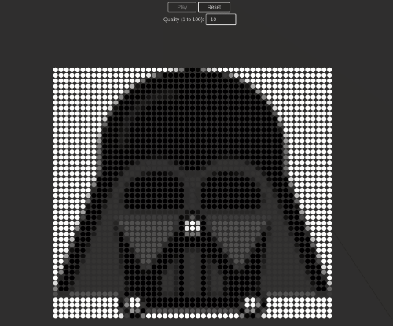

# Dot-Follow
Node-gyp study, consisting of C++, Node.js and static website with d3. Express server analyzes BMP image using low-level bitmap library, and serves it to the front-end to produce cool transition of circles changing their brightness to match the target. User can change the quality - number of dots used to represent the picture.

## C++ bmp2json module
The backbone of the project - transformation from bmp to array of integers - is carried by the C++ module, which is wrapped in Napi class. Making it into the JavaScript module I've produced the following:
**Functions:**
- `getBrightPixelMatrix(string src, int divisor, string colour)` - Returns 2-D array of float numbers, which represent either summed red, green and blue values or just brightness of a single colour if it's specified.
- `getColourPixelMatrix(string src, int divisor)` - Returns 2-D array of objects, which represents RGB values in the picture, e.g.:
*[[ { red: 0.2, blue: 0.1, green: 0.5 } ]]*
**Params:**
- `src` - the path of the bmp file to be converted relative to the project root.
- `divisor` - the magnitude of data scaling. If picture is 512x512 then the divisor value of 2 will mean that the resulting array will be 256x256 in length, 4 - 128x128 and so on.

## D3 website
The transition part is carried with the help of d3 library and is simple and minimal to show the back-end capabilities in practice without overdo.

